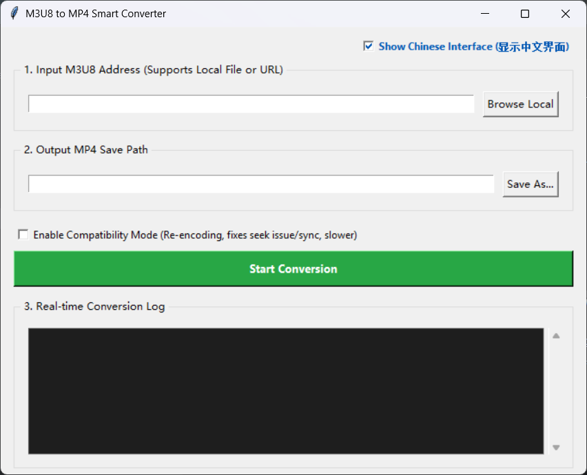
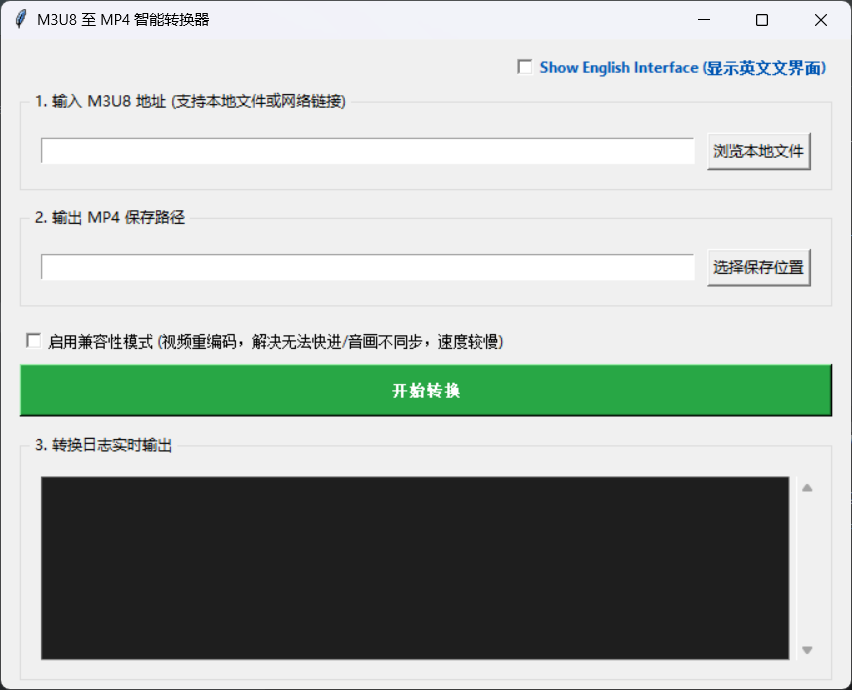

# M3U8 to MP4 Smart Converter / M3U8至MP4智能转换器

A simple and elegant Tkinter GUI tool to convert M3U8 to MP4 using FFmpeg. Supports both Express (Stream Copy) and Compatibility (Re-encoding) modes.
一个基于 Python Tkinter 的 M3U8 转 MP4 图形界面工具。支持极速流复制与高兼容性重编码双模式。

## How to use / 如何使用
1. Download the executable from the [Releases](https://github.com/GeorgeSmith215/m3u8-to-mp4/releases/tag/v1.0.0) page.
2. Run `m3u8-to-mp4.exe`.
3. Paste URL or browse local `.m3u8` file, click convert.

从 Releases 页面下载编译好的 `m3u8-to-mp4.exe`，直接双击运行即可。

Preview / 预览

